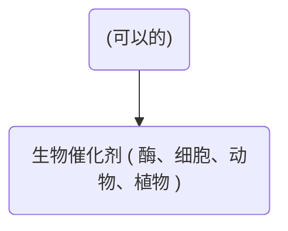

# 测试
#alksjdf #lkjlaskdf 

<progress max=100 value=90></progress>

```dataview
table without id
file.link as "Try", file.cday as "创建日期", "<progress max=100 value=" + round((a/b)*100) + "></progress>" + round((a/b)*100) + "%" as 进度条
```

```cpp
#include <iostream>

int main()
{
	return 0;
}
```
#代码块 #CPP

[^1]: lkjlasdflkajsdf

:luc_smile: :obs_go_to_file: :obs_search: :smile:

![[Canvas.canvas]]

<iframe width="560" height="315" src="https://www.bilibili.com/" />

![[ZhiXi/测试 2023.01.21 17.27.11.png]]%%[[ZhiXi/测试 2023.01.21 17.27.11.zxm| :luc_edit: Edit it.]]%%
#图 #脑图

![[随手记/剧本杀]]

$\lim_{n \to + \infty} \sum_{0}^{n} x \left ( n \right ) = \int_{0}^{+ \infty} x \left ( n \right )$

$$
\lim_{n \to + \infty} \sum_{0}^{n} x \left ( n \right ) = \int_{0}^{+ \infty} x \left ( n \right )
$$

# A

## B

### C

##### E

#### D

###### F

> [!multi-column]
> 
> > [!tip]+ 试试 Task
> > 
> > - [x] 1
> > - [ ] 2
> > - [ ] 3
> 
> > [!blank]
> > 
> > # 大标题
> > 
> > - [ ] First
> > - [x] Second
> > - [ ] Third
> 
> > [!blank]
> > - 一
> > - 二
> > - 三

lkjsadf  

![[attachments/PanDownload-背景.jpg]]

[list2mermaid]
- a
	- b
		- c
		- d
	- e
		- f
		- g

[list2mdtab]
- 表格
	- 
		| asdfklj | asdfjk | alskdjf | asdf  |asdf| asdf |
		|:-------:|:------:|:-------:|:-----:|:---------:|:----:|
		|  asdfa  | asdfas | asdfasd | asdf  | llkjalsdf | asdf |
		|  fgkjy  |  kuh   |   kg    | gjhgj |   jhkjh   |  kh  |
		|   kjl   |  lkj   |   lkj   |  lkj  |   hgjkg   |  kl  |
- 思维导图
	- [list2mermaid]
		- a
			- b
				- c
				- d
				- e
			- f
				- g
				- h
				- i
			- j
				- k
				- l
				- m
- 图片
	- ![[attachments/测试 2023.02.14-1.jpg]]

![[Excalidraw/测试's Excalidraw 2023.02.14 14.52.49.svg]]%%[[Excalidraw/测试's Excalidraw 2023.02.14 14.52.49.md|🖋 Edit in Excalidraw]], and the [[Excalidraw/测试's Excalidraw 2023.02.14 14.52.49.dark.svg|dark exported image]]%%

```markmap
- a
	- b
		- c
		- d
		- e
	- f
		- g
		- h
		- i
	- j
		- k
		- l
		- m
```

[![[Excalidraw/测试's Excalidraw 2023.02.14 14.52.49.svg]]](https://www.baidu.com)

- asdf
	- laksjdf
	- lkasjdf
- lajksdlf
	- lkjsdf
	- lkjasdf
 
![[测试#^h40jm1]]

1. lkajsdf
	1. lkjsdf
	2. lkasdf
	3. ljksdf
2. lajksdf
	1. kljasdf
	2. ljksdf
3. ljasdflk
	1. lkjasdf
	2. asdf
	3. kljsf

^h40jm1

