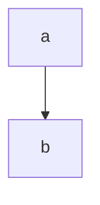

# 测试
#alksjdf #lkjlaskdf 

lkjasldkfja[^1]alkjalskdflkjlasdfasdf

```cpp
#include <iostream>

int main()
{
	return 0;
}
```

![[Excalidraw/测试's Excalidraw 2022.12.08 20.54.31.svg]]%%[[Excalidraw/测试's Excalidraw 2022.12.08 20.54.31.md|🖋 Edit in Excalidraw]], and the [[Excalidraw/测试's Excalidraw 2022.12.08 20.54.31.dark.svg|dark exported image]]%%

[^1]: lkjlasdflkajsdf

:luc_smile: :obs_go_to_file: :obs_search: :smile:

as
asdfljklasd

20:11:4o1

![[Canvas.canvas]]

<iframe width="560" height="315" src="https://www.bilibili.com/" />

我是一个好人，你可不要污蔑我！

ljsdflkj

asdfasdf
asdfas

azsdf

```start-multi-column
ID: ID_aj4f
number of columns: 2
largest column: standard
border: off
shadow: off
```

> [!note]+ 笔记
> 
> asdf

--- end-column ---

> [!summary]+ 摘要
> 
> asldk

=== end-multi-column

![[ZhiXi/测试 2023.01.21 17.27.11.png]]%%[[ZhiXi/测试 2023.01.21 17.27.11.zxm| :luc_edit: Edit it.]]%%

![[剧本杀]]

$\lim_{n \to + \infty} \sum_{0}^{n} x \left ( n \right ) = \int_{0}^{+ \infty} x \left ( n \right )$

$$
\lim_{n \to + \infty} \sum_{0}^{n} x \left ( n \right ) = \int_{0}^{+ \infty} x \left ( n \right )
$$

# A

## B

### C

#### D

##### E

###### F

> [!multi-column]
> 
> > [!tip]+ 试试 Task
> > 
> > - [x] 1
> > - [ ] 2
> > - [ ] 3
> 
> > [!blank]
> > 
> > # 大标题
> > 
> > - [ ] First
> > - [x] Second
> > - [ ] Third
> 
> > [!blank]
> > - 一
> > - 二
> > - 三



lkjsadf  

![[Excalidraw/测试's Excalidraw 2023.02.01 22.03.01.svg]]
%%[[Excalidraw/测试's Excalidraw 2023.02.01 22.03.01.md|🖋 Edit in Excalidraw]], and the [[Excalidraw/测试's Excalidraw 2023.02.01 22.03.01.dark.svg|dark exported image]]%%